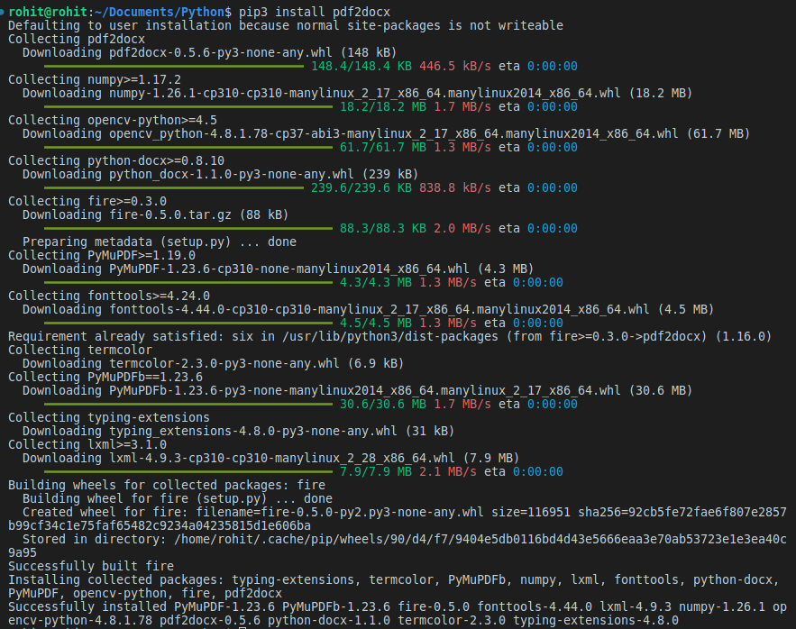
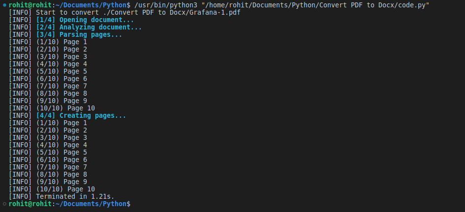
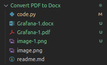

# Convert PDF to Docx

### Pre-requisites:

- So First we install the required packages named as pdf2docx

```bash
pip3 install pdf2docx
```



### Process:

- **This line is a Python import statement. It's used to include the "converter" module from the "pdf2docx" package in your Python code.**

```python
from pdf2docx import Converter
```

- Now we will named a variable as "pdf_file" in which we will assign the path of the pdf file which we want to convert into docx file.

```python
# In your case, you will need to change the path to the PDF file you want to convert:
pdf_file = "./path/to/pdf/file.pdf"
```

- Now we will named a variable as "docx_file" in which we will assign the path of the docx file which we want to create.

```python
# In your case, you will need to change the path to the DOCX file you want to create:
docx_file = "./path/to/docx/file.docx"
```

- Now we will create a function named as "convert_pdf_to_docx" in which we will pass the pdf_file and docx_file as a parameter.

```python
#This will initialize the PDF to DOCX conversion process.
cv = Converter(pdf_file)
```

- Here the actual conversion happens. The PDF file is converted to a DOCX file and saved in the path specified by the "docx_file" variable.

```python
cv.convert(docx_file)
```

- This will close the PDF to DOCX converter.

```python
cv.close()
```

### Summary:

- So,this code initializes a PDF-to-DOCX conversion using the "pdf2docx" package, specifying the input PDF file, the output DOCX file, and then performs the conversion, and closes the process when finished.

---

### OUTPUT:

- Python Code Runned Successfully on Terminal.



- Generated Docx File.



---
